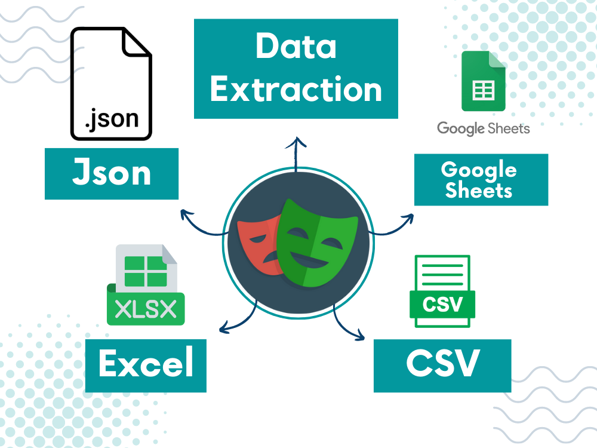

# ETL Scraping NikeStore Using PlayWright

In this project, I will scrape shoes data from the Nike website using Python as the main programing language and some framework tools like PlayWright for Automation Work and Selectolex for Data Extracting From Html 

then I will load data into “Four” different formats 

- JSON
- Google Spreadsheet
- CSV
- Excel

